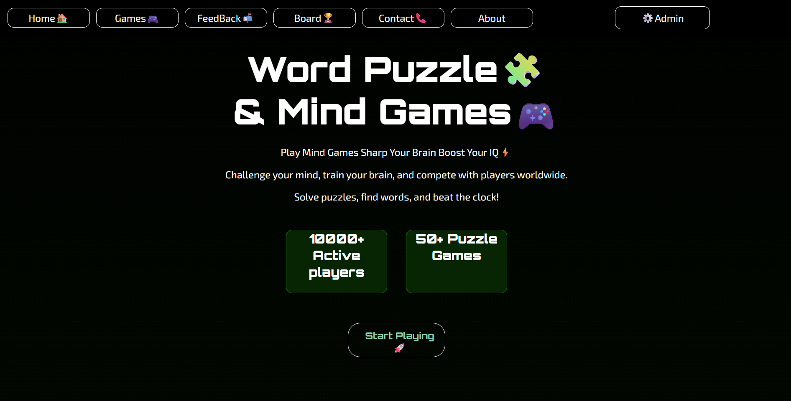
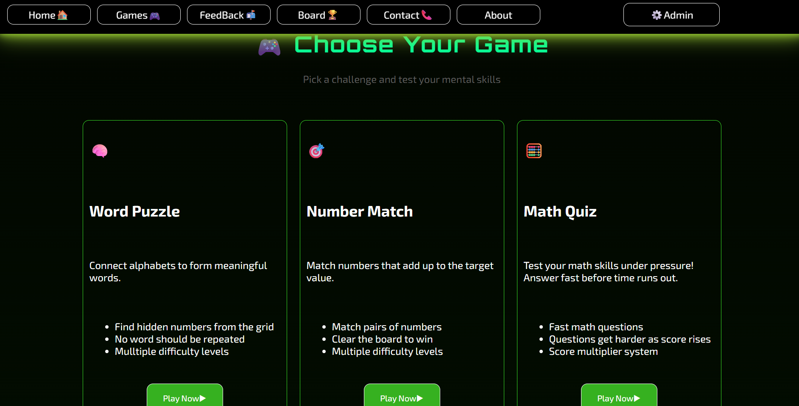
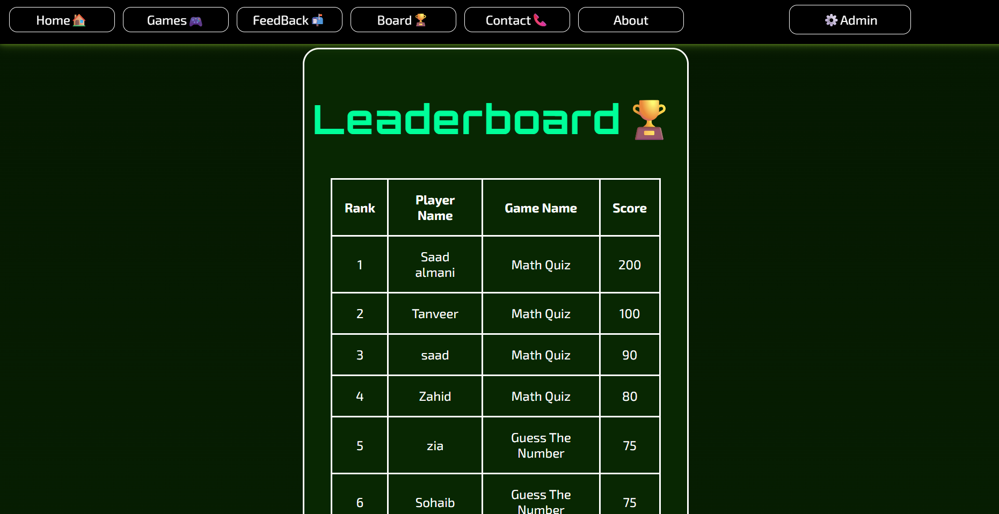
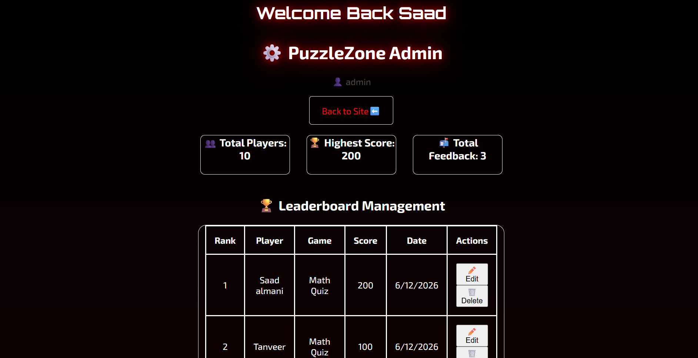

# Word Puzzle & Mind Games Hub 🧩🎮

A browser-based gaming platform built with HTML, CSS, JavaScript, and JSON Server.

---

## 👨‍💻 Developer

- **Name:** Saadullah Hassan
- **University:** Islamia University Bahawalpur
- **Semester:** BSCS 4th Semester

---

## 🚀 Features

- 🎮 3 Playable Games — Guess The Number, Math Quiz, Number Match
- 🏆 Live Leaderboard — scores saved & ranked automatically
- 📬 Feedback Form — with inline validation
- ⚙️ Admin Panel — login protected, manage leaderboard & feedback
- 📊 Admin Statistics — total players, highest score, total feedback

---

## 🎮 Games

| Game | Description |
|------|-------------|
| Guess The Number 🔮 | Guess secret number between 1-100, fewer tries = more points |
| Math Quiz 🧮 | Answer 10 math questions, 10 points each |
| Number Match 🎯 | Click 2 numbers that add up to 10 |

---

## ⚙️ Admin Panel

- **URL:** `admin.html`
- **Username:** `admin`
- **Password:** `12345`
- **Features:** View leaderboard, edit entries, delete entries, view & delete feedback

---

## 🛠️ Tech Stack

- HTML5
- CSS3
- JavaScript (Vanilla)
- JSON Server (REST API)
- Google Fonts (Orbitron, Exo 2)

---

## 📁 Project Structure

Semester project/

├── index.html       # Main user page

├── admin.html       # Admin panel

├── styles.css       # All styling

├── app.js           # User page logic

├── admin.js         # Admin panel logic

├── db.json          # JSON Server database

└── README.md        # Project documentation

## 🔧 Installation & Setup

**Step 1 — Install JSON Server:**
npm install -g json-server

**Step 2 — Start JSON Server:**
json-server --watch db.json --port 3000

**Step 3 — Open Project:**
Open index.html in browser

## 🌐 API Endpoints

| Method | Endpoint | Description |
|--------|----------|-------------|
| GET | /leaderboard | Fetch all scores |
| POST | /leaderboard | Save new score |
| PATCH | /leaderboard/:id | Edit score |
| DELETE | /leaderboard/:id | Delete score |
| GET | /feedback | Fetch all feedback |
| POST | /feedback | Submit feedback |
| DELETE | /feedback/:id | Delete feedback |

---

## 📸 Screenshots

### Home Page

### Games

### Leaderboard

### Admin Panel

---

## 📄 License

This project was created as a semester project for Web Technologies course.

© 2026 Saadullah Hassan — All Rights Reserved